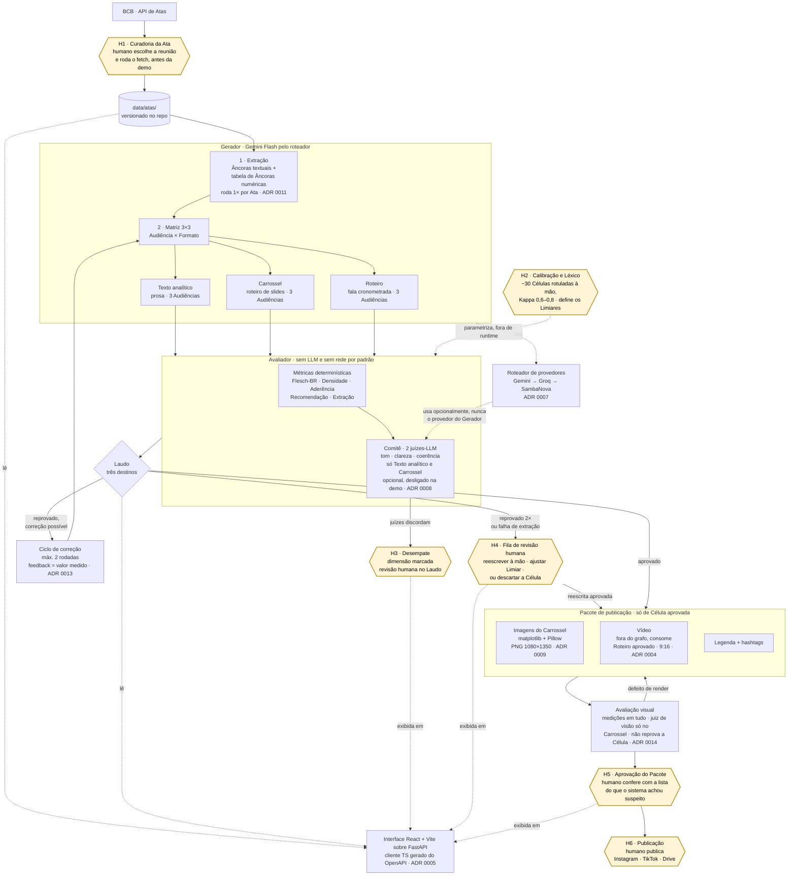

# Arquitetura — Suno Content

Este documento descreve o fluxo ponta a ponta do sistema e referencia o ADR que justifica cada
decisão. Não repete o *porquê* — isso já está nos ADRs — só mostra como as peças se encaixam.

## Como funciona, em palavras simples

Antes do diagrama, a versão que se explica numa conversa.

O Banco Central publica, a cada reunião, um documento denso sobre a decisão de juros. Quase
ninguém fora do mercado lê até o fim. Este sistema pega esse documento e escreve nove versões
dele — uma para cada combinação de três tipos de leitor (quem está começando, quem já acompanha,
quem trabalha com isso) e três formatos (um texto para ler, um carrossel de imagens, um roteiro de
vídeo curto). O que ele tem de diferente é que nada sai antes de passar por uma prova.

Começa com uma pessoa escolhendo de qual reunião o conteúdo vai falar. O documento fica guardado
no próprio projeto, então a demonstração funciona sem internet.

O sistema então lê o documento e faz uma coisa parecida com um fichamento: anota à parte todos os
números e datas importantes — o juro que ficou valendo, quanto subiu ou caiu, o resultado da
votação, quando é a próxima reunião — e junto de cada anotação guarda o trecho exato de onde ela
saiu. Daí para frente, nenhum número é escrito de novo pela inteligência artificial: ele é
**copiado** dessa lista. É a diferença entre citar e lembrar de cabeça, e é o que impede o sistema
de inventar um número que soa plausível.

Com o fichamento pronto, a inteligência artificial escreve as nove versões, todas ao mesmo tempo.
Fazer uma depois da outra levaria minutos demais para uma apresentação ao vivo.

Aí entra a parte que é o coração do projeto: um corretor. Ele não usa inteligência artificial —
são contas e regras, o que significa que ele dá sempre a mesma resposta para o mesmo texto e pode
ser testado sozinho, sem depender de nada. Ele faz quatro perguntas a cada versão. O texto está
fácil de ler no ponto certo para aquele leitor — nem difícil demais para quem está começando, nem
raso demais para quem é do ramo? Os termos de mercado aparecem explicados quando precisavam
aparecer explicados? Cada número confere com o fichamento? E a pergunta que não tem margem: o
texto sugere comprar, vender ou promete retorno? Sugerir investimento é atividade regulada no
Brasil, e este sistema informa, não aconselha. Quem cruza essa linha é reprovado, ponto.

O corretor devolve um boletim com as medidas e o resultado. Reprovado volta para ser reescrito,
levando na mão o número exato que faltou — "faltaram três pontos para o texto ficar fácil o
bastante" em vez de "melhore o texto". Isso acontece no máximo duas vezes; a partir daí, insistir
custa mais do que rende. A versão que continua reprovando não é jogada fora nem publicada: vai
para uma fila que uma pessoa abre e resolve, escrevendo à mão, mudando a régua, ou aceitando que
aquele assunto não rende naquele formato.

O que passa vira um pacote pronto para publicar: as imagens do carrossel, desenhadas pelo próprio
sistema a partir dos números do fichamento, o vídeo, a legenda. Aí tem uma segunda conferência, de
outra natureza: até aqui só o texto foi avaliado, e um desenho pode sair torto mesmo com o texto
certo — palavra cortada na borda, letra em cima do gráfico, cor que não dá para ler. Então o
sistema mede o que é mensurável e, quando ligado, mostra as imagens do carrossel a uma
inteligência artificial que sabe olhar figura, só para responder "isso parece quebrado?". Isso não
reprova o texto, que já passou; serve para avisar que vale refazer o desenho. O vídeo não passa por
essa conferência automática — dele se mede o tamanho e o som, e quem assiste é uma pessoa, que para
um vídeo de um minuto vê tudo e não uma amostra. Depois uma pessoa confere se
está apresentável e publica ela mesma no Instagram, no TikTok ou no Drive. Não existe publicação
automática, de propósito — a última assinatura é sempre humana.

A razão de tudo estar partido em duas metades, quem escreve e quem corrige, é simples: se a mesma
inteligência artificial escrevesse e se avaliasse, ela se daria boas notas. Há registro disso
acontecendo, inclusive de modelo inventando a nota que alega ter tirado. Separar as duas coisas, e
deixar a correção sem depender de inteligência artificial nenhuma, é o que torna o resultado
verificável por outra pessoa.

## Diagrama

Os nós em destaque (`H1`–`H6`) são os pontos onde um humano age. Não são exceções ou fallbacks:
são parte do desenho. O sistema informa e prepara; quem decide publicar é uma pessoa.

## Os seis pontos de interferência humana

| | Momento | Quem | O que decide |
|---|---|---|---|
| **H1** | Antes da execução | Qualquer um do time | Qual Ata entra. O fetch no BCB é comando separado; a demo roda sem rede ([ADR 0006](adr/0006-atas-do-copom-como-documento-fonte-principal.md)) |
| **H2** | Fora de runtime | Dona do Avaliador | Os Limiares, o Léxico e os padrões sintáticos. Deriva de ~30 Células rotuladas pelas duas pessoas, com Kappa reportado. Parametriza o Avaliador; não roda durante a execução |
| **H3** | Durante a avaliação | Dona do Avaliador | Desempate quando os dois juízes discordam numa dimensão subjetiva. O sistema não gasta uma terceira chamada para desempatar ([ADR 0008](adr/0008-comite-de-juizes-llm-como-camada-opcional-do-avaliador.md)) |
| **H4** | Depois de 2 correções | Qualquer um do time | O que fazer com a Célula que o Gerador não conseguiu consertar, ou com a Ata que o extrator não conseguiu ler ([ADR 0013](adr/0013-teto-de-duas-rodadas-no-ciclo-de-correcao-e-fila-de-revisao-humana.md)) |
| **H5** | Antes de publicar | Qualquer um do time | Se o Pacote está apresentável. Aprovação do Laudo é sobre conteúdo; aqui se confere render, corte e legenda, com a lista da avaliação visual em mão ([ADR 0014](adr/0014-o-pacote-de-publicacao-tem-avaliacao-visual-propria.md)) |
| **H6** | Publicação | Qualquer um do time | Publica. Não há integração de API com Instagram, TikTok ou Drive, por decisão |

H3, H4 e H5 aparecem na interface como filas. H1 e H2 são trabalho de linha de comando e de
planilha, feitos antes.

## Os dois módulos

**Gerador** ingere a Ata, extrai as Âncoras e produz as nove Células — uma por combinação de
Audiência (Iniciante, Intermediário, Avançado) e Formato (Texto analítico, Carrossel, Roteiro) —
em paralelo. Em sequência a demo morre esperando; em paralelo, minutos. É uma sequência fixa de
chamadas estruturadas, não um agente com tools nem um loop ReAct, e não usa MCP — não há decisão
dinâmica de "o que fazer a seguir" a resolver
([ADR 0010](adr/0010-gerador-nao-e-agente-com-tools-nem-usa-mcp.md)).

**Avaliador** recebe `(Conteúdo, Âncora[], Audiência)` de uma Célula e devolve um Laudo. Por
padrão roda sem LLM e sem rede — é isso que o mantém testável em CI desde o dia 1, com texto
colado à mão, sem esperar o Gerador existir. O contrato entre os dois módulos é essa única
assinatura; nada mais atravessa a costura
([ADR 0001](adr/0001-gerador-e-avaliador-como-modulos-separados.md)).

## O estágio de extração

Roda uma vez por Ata, antes da Matriz, e produz duas coisas:

- **Âncoras textuais** — afirmações factuais em prosa, contra as quais a Aderência é medida.
- **Tabela de Âncoras numéricas** — Selic, variação em pontos base, IPCA, placar da votação,
  datas. Cada registro guarda valor, unidade e o trecho literal da Ata de onde veio.

A tabela é o insumo **único** de número no sistema. O Gerador substitui em molde em vez de
reescrever o número em prosa, e o Avaliador confere por igualdade exata — sem LLM, sem julgamento
([ADR 0011](adr/0011-ancoras-numericas-sao-citadas-nunca-reescritas.md)). O texto da Célula, a
legenda do Pacote e o gráfico do Carrossel leem todos da mesma tabela.

Extração degradada é motivo de reprovação próprio, e vai direto para H4 sem passar pelo Ciclo de
correção: reescrever não conserta um documento mal lido.

## Os quatro produtores

Os três primeiros são Formatos e vivem dentro do Gerador. O quarto vive fora do grafo.

### Texto analítico

O resumo analítico em prosa. Estrutura fixa em três partes: **o que foi decidido** (a Âncora
numérica principal, citada), **por que** (o argumento da Ata, parafraseado), **o que observar
adiante** (sem projeção própria, só o que a Ata sinaliza).

| | Iniciante | Intermediário | Avançado |
|---|---|---|---|
| Flesch-BR | ≥ 50 | 25–50 | < 25 |
| Termo do Léxico | sempre com explicação na primeira ocorrência | explicação só para termo fora do núcleo | sem explicação |

Saída em Markdown, para a interface e para o relatório. É o Formato mais barato de gerar e o mais
fácil de avaliar, e por isso é o primeiro a ser implementado ponta a ponta.

### Carrossel

O Gerador produz o **roteiro de slides** — texto estruturado, um registro por slide com título,
corpo e o campo opcional de dado a plotar. O Avaliador julga esse texto, não a imagem.

A renderização é etapa posterior, determinística e sem rede: **matplotlib** desenha o gráfico a
partir da tabela de Âncoras numéricas, **Pillow** compõe com a identidade visual, saída **PNG
1080×1350 (4:5) em todos os slides de todas as nove Células**. Proporção variando entre Células
faz o Instagram cortar o carrossel inteiro para igualar a primeira imagem — é requisito técnico,
não estética.

Nenhuma imagem vem de terceiro, e geração por modelo de IA está fora do caminho crítico
([ADR 0009](adr/0009-imagens-do-pacote-de-publicacao-sao-geradas-nunca-raspadas.md)). Por ser
determinística, a renderização é testável em CI como o Avaliador.

### Roteiro

Fala cronometrada para vídeo vertical. O Gerador produz blocos de fala com marcação de tempo e
indicação do que aparece na tela em cada bloco. O primeiro bloco é o gancho; os Limiares de
Flesch-BR valem sobre o texto falado, não sobre a rubrica de cena.

O Roteiro é o único Formato que não passa pelo comitê de juízes-LLM: só as métricas
determinísticas o avaliam. É a mesma razão pela qual o vídeo pronto também não vai a juiz de visão
— o ramo do vídeo é o primeiro a cair sob atraso, e não se gasta cota avaliando o que pode não ser
entregue.

O Gerador **termina aqui**. Narração, composição, legenda e lip-sync vivem depois, atrás de outra
interface ([ADR 0004](adr/0004-renderizacao-de-video-fora-do-grafo.md)).

### Vídeo

Job **fora de banda** que consome Roteiros já aprovados pelo Avaliador. Nunca é nó do grafo: o
vídeo é critério eliminatório do case e renderização falha de formas criativas e demoradas — se
quebrar na véspera, os seis entregáveis continuam de pé e a demo usa um mp4 já renderizado.

Caminho principal é composição determinística em CPU. Avatar falante é alternativa, e é o item 3
da ordem de corte do CLAUDE.md — o primeiro a virar "vídeo sem rosto" quando o prazo apertar.

Nenhum LLM olha o mp4. Duração, proporção e presença de áudio são medidas; o resto é uma pessoa
assistindo no H5, que para sessenta segundos de vídeo é revisão completa, não amostra.

Um único mp4, 9:16, com dois destinos: a galeria da aplicação e o Pacote de publicação. Gerar um
vídeo "para o app" e outro "para as redes" é o erro a evitar.

## A avaliação visual do Pacote

O Avaliador julga texto, e julga antes de qualquer imagem existir. Isso deixa um vão: o render
determinístico sai sempre igual, mas não sai necessariamente certo — texto estoura a caixa, rótulo
se sobrepõe no gráfico, contraste fica ilegível, legenda dessincroniza do áudio.

Duas camadas cobrem esse vão, no mesmo padrão do resto do projeto
([ADR 0014](adr/0014-o-pacote-de-publicacao-tem-avaliacao-visual-propria.md)).

**Medições, sempre ligadas e sem rede.** Estouro de caixa medido pelo Pillow, razão de contraste,
dimensão exata, número no gráfico conferido contra a tabela de Âncoras numéricas, duração e áudio
do vídeo. Falha aqui é defeito de render: refaz o render.

**Juiz de visão, opcional e só no Carrossel.** Olha a imagem pronta e responde o que não se mede —
isto parece quebrado, o layout está equilibrado, o gráfico comunica o que a legenda promete. É o
único lugar do sistema onde um juiz holístico é aceitável, porque aqui não existe número a atingir.
O Carrossel é julgado em folha de contato, todos os slides de uma Célula numa imagem só: três
chamadas de visão por Ata em vez de dezoito, e inconsistência entre slides é justamente o defeito
que se vê melhor em conjunto.

**O vídeo não vai a juiz nenhum**, nem antes nem depois de renderizar: o Roteiro passa só pelas
métricas determinísticas, e o mp4 só pelas medições de duração, proporção e áudio. Quadro
amostrado não mostra movimento nem sincronia, que é onde vídeo falha, e o vídeo já tem o revisor
que a imagem não tem — uma pessoa assiste antes de publicar. O ramo do vídeo é determinístico de
ponta a ponta.

Duas fronteiras importam. O juiz visual **nunca julga Recomendação** — isso é verificado no texto,
antes do render, sem LLM. E a avaliação visual **não entra no Laudo e não reprova a Célula**: o
texto já foi aprovado, e reescrevê-lo não conserta um rótulo sobreposto. O resultado vai anexado
ao Pacote para o H5, que deixa de ser inspeção humana cega e passa a ser inspeção humana com uma
lista.

A restrição de provedor do comitê não vale aqui: a imagem não foi gerada por LLM, então não há
autopreferência a evitar, e o juiz visual pode rodar em qualquer provedor.

## O roteador de provedores

Uma única interface por trás da qual vivem Gemini (gera), Groq (julga) e SambaNova (reserva) — o
resto do pipeline não sabe qual provedor está ativo. Distingue cota por minuto de cota diária
antes de decidir entre esperar e trocar, e reaplica bindings de saída estruturada ao trocar de
cliente, para não perder a capacidade de produzir o schema da Célula no meio de uma troca
silenciosa ([ADR 0007](adr/0007-roteador-de-provedores-distingue-tipo-de-429.md)).

Com o comitê ligado, os três provedores ficam ocupados numa mesma execução — Gerador num, dois
juízes nos outros — e não sobra reserva para 429. É mais uma razão para o comitê ficar desligado
na demo.

## O Avaliador e o Laudo

Cinco medidas determinísticas: **Flesch-BR** (fórmula própria, não `textstat` —
[ADR 0002](adr/0002-flesch-br-implementado-no-projeto.md)), **Densidade** contra o Léxico,
**Aderência** contra as Âncoras, **Recomendação** por Léxico mais padrão sintático em POS tagging
([ADR 0012](adr/0012-recomendacao-detectada-por-padrao-sintatico-nao-por-lista-de-palavras.md)) e
**integridade da extração**.

Sobre elas, opcionalmente, o comitê de dois juízes-LLM em dimensões subjetivas — tom, clareza,
coerência — e só em dois dos três Formatos, Texto analítico e Carrossel. Compliance e Aderência
nunca passam por LLM, nem como segunda opinião
([ADR 0008](adr/0008-comite-de-juizes-llm-como-camada-opcional-do-avaliador.md)).

O Laudo tem três destinos, não dois: aprovado, reprovado com correção possível, e reprovado para
revisão humana. O motivo de reprovação é valor enumerado, não texto livre — é o que permite contar
reprovação por tipo no relatório final.

## A interface

React + Vite + Tailwind sobre FastAPI, com cliente TypeScript gerado do OpenAPI
([ADR 0005](adr/0005-interface-em-react-vite-sobre-fastapi.md)), lendo do disco — o mesmo arquivo
que o pytest lê e que o relatório cita. Três coisas que ela mostra e que a concorrência não mostra:

- **Âncoras destacadas** ao lado da Célula: quais Âncoras aquela Célula usou e o trecho da Ata de
  cada uma. Expõe o que o Avaliador já calcula.
- **Reprovação como view de primeira classe**: reprovado, e por quê, com o Limiar e a distância
  medida. É a prova viva de que a linha que não se cruza funciona.
- **Veredito em linguagem com o número ao lado** — "Alta aderência factual · 0,94". O rótulo é o
  que se lê; o número é o que o case cobra. Destaque visual reservado à ausência de Recomendação.

Mais as três filas humanas: desempate (H3), revisão (H4) e aprovação do Pacote (H5).

## Parâmetros ainda não fixados

Número de slides do Carrossel, duração-alvo do Roteiro e comprimento do Texto analítico por
Audiência não estão decididos aqui. São conhecimento de domínio da dona do Avaliador e saem da
Calibração (H2), junto com os Limiares.

## O que este diagrama não mostra

Prioridade de corte sob atraso e a divisão de dono por módulo estão no CLAUDE.md. Cada ideia de
inovação que entrou ou ficou de fora já virou ou atualizou um ADR — não há registro de triagem
separado dos ADRs.
